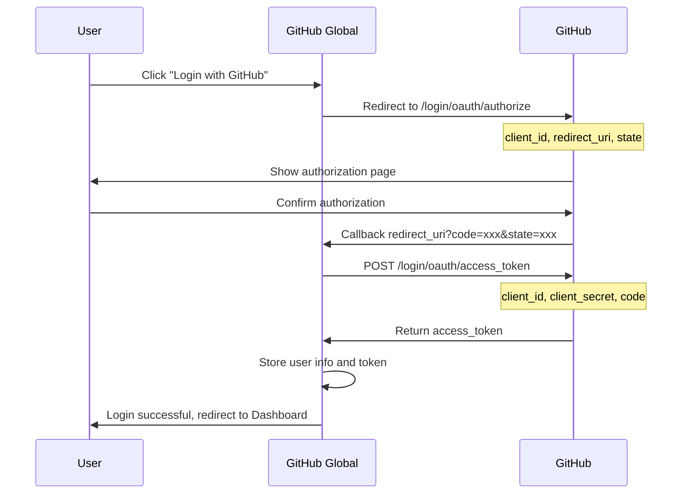

The user wants me to translate a technical documentation from zh-CN to en. I need to:
1. Preserve all Markdown formatting
2. NOT translate code snippets, variable names, function names, or technical identifiers
3. NOT translate URLs, file paths, or command-line examples
4. Preserve the original document structure
5. Maintain professional and accurate translation tone
6. Keep inline code untranslated
7. Translate comments in code blocks if they are in the source language
8. Preserve all HTML tags and their attributes
9. Keep emojis and special characters as-is
10. Do NOT add any explanations or notes

Let me go through the document and translate it section by section.
</think>

# GitHub Global - Technical Implementation Document

> Version: v1.0.0
> Date: 2026-01-21
> Author: Technical Architect
> Status: Pending Review

---

## 1. Document Overview

### 1.1 Purpose

Based on the Requirements Specification Document v1.0.0, this document provides a detailed technical implementation plan for the GitHub Global project, including technical architecture, core module design, API specifications, database design, and third-party service integration.

### 1.2 Scope

- Technical implementation for MVP (Minimum Viable Product) phase
- Technical reference for development team

### 1.3 Technical Research Sources

- GitHub REST API Official Documentation (2025-2026)
- GitHub App Official Documentation
- OpenRouter API Official Documentation
- Industry Best Practices

---

## 2. Technology Stack Selection

### 2.1 Technology Stack Overview

| Layer | Technology | Version Requirement | Selection Reason |
|-------|------------|---------------------|------------------|
| **Frontend Framework** | Next.js 15 (App Router) | ^15.0.0 | Mainstream full-stack framework 2025-2026; SSR/SSG support; Native TypeScript support; React 19 support |
| **UI Component Library** | shadcn/ui + Tailwind CSS | Latest | Modern design; Highly customizable; Excellent performance; No runtime dependencies |
| **Programming Language** | TypeScript | ^5.0.0 | Type safety; Excellent developer experience; Complete IDE support |
| **Database** | MySQL | ^8.0 | Mature and stable; Widely used; Easy to maintain |
| **ORM** | Prisma | ^6.0.0 | Type safety; Migration management; Query builder |
| **Background Task Queue** | Local task queue (extensible to BullMQ + Redis) | - | Local queue for MVP, expandable to Redis |
| **AI Integration** | OpenRouter API | - | Unified access to multiple models; Fallback support; Cost optimization |
| **GitHub Integration** | GitHub App + Octokit | - | Fine-grained permission control; Automatic token expiration; More secure |
| **Authentication** | NextAuth.js v5 | ^5.0.0 | GitHub App OAuth integration; Session management |
| **Deployment** | Docker containerization | - | Portability; Environment consistency; Easy to scale |

### 2.2 Project Structure

```
github-global/
├── src/
│   ├── app/                      # Next.js App Router pages
│   │   ├── (auth)/              # Authentication related pages
│   │   │   ├── login/
│   │   │   └── callback/
│   │   ├── (dashboard)/         # Dashboard pages
│   │   │   ├── dashboard/
│   │   │   ├── repo/[id]/
│   │   │   ├── task/[id]/
│   │   │   └── settings/
│   │   ├── api/                 # API routes
│   │   │   ├── auth/
│   │   │   ├── github/
│   │   │   ├── repos/
│   │   │   ├── translations/
│   │   │   └── webhooks/
│   │   ├── layout.tsx
│   │   └── page.tsx
│   ├── components/              # React components
│   │   ├── ui/                  # shadcn/ui base components
│   │   ├── layout/              # Layout components
│   │   ├── repo/                # Repository related components
│   │   ├── translation/         # Translation related components
│   │   └── common/              # Common components
│   ├── lib/                     # Core libraries
│   │   ├── github/              # GitHub API wrapper
│   │   ├── openrouter/          # OpenRouter API wrapper
│   │   ├── translation/         # Translation engine
│   │   ├── queue/               # Task queue
│   │   ├── db/                  # Database utilities
│   │   └── utils/               # Utility functions
│   ├── types/                   # TypeScript type definitions
│   ├── hooks/                   # React Hooks
│   └── config/                  # Configuration files
├── prisma/
│   └── schema.prisma            # Database Schema
├── public/                      # Static assets
├── docker/
│   ├── Dockerfile
│   └── docker-compose.yml
├── docs/                        # Documentation
├── tests/                       # Tests
├── .env.example                 # Environment variables example
├── package.json
├── tsconfig.json
└── tailwind.config.ts
```

---

## 3. GitHub App Integration Solution

### 3.1 Why Choose GitHub App

According to GitHub's official documentation (2025-2026), GitHub App has the following advantages over OAuth App:

| Feature | GitHub App | OAuth App |
|---------|------------|-----------|
| Permission Control | Fine-grained permissions (e.g., read-only contents) | Coarse-grained scopes (repo includes all permissions) |
| Token Expiration | Automatic expiration after 1 hour | Never expires (requires manual revocation) |
| Rate Limit | Scalable (based on installation count and user count) | Fixed 5000/hour/user |
| Independent Execution | Can run independently of users | Must be bound to user |
| Webhook | Built-in centralized management | Requires separate configuration |

### 3.2 GitHub App Configuration

#### 3.2.1 Creating a GitHub App

Create a new GitHub App in GitHub Settings > Developer settings > GitHub Apps:

**Basic Information:**
- **App Name**: `GitHub Global`
- **Homepage URL**: `https://your-domain.com`
- **Callback URL**: `https://your-domain.com/api/auth/callback/github`
- **Setup URL**: `https://your-domain.com/dashboard` (redirect after installation)
- **Webhook URL**: `https://your-domain.com/api/webhooks/github`
- **Webhook Secret**: Randomly generated secret

#### 3.2.2 Permission Configuration

**Repository Permissions:**

| Permission | Level | Purpose |
|------------|-------|---------|
| **Contents** | Read & Write | Read repository files, create translation files, create branches |
| **Metadata** | Read | Read basic repository information |
| **Pull requests** | Read & Write | Create and manage Pull Requests |
| **Webhooks** | Read & Write | Receive repository event notifications (optional, for auto-sync) |

**Account Permissions:**

| Permission | Level | Purpose |
|------------|-------|---------|
| **Email addresses** | Read | Get user email for commit authorship |

#### 3.2.3 Webhook Event Subscriptions

| Event | Purpose |
|-------|---------|
| `push` | Detect code changes, trigger incremental translation (P2 feature) |
| `installation` | Listen for App installation/uninstallation events |
| `installation_repositories` | Listen for repository add/remove events |

### 3.3 Authentication Flow

#### 3.3.1 User Authorization Flow (User Access Token)



**Authorization URL Construction:**

```typescript
const authUrl = new URL('https://github.com/login/oauth/authorize');
authUrl.searchParams.set('client_id', GITHUB_APP_CLIENT_ID);
authUrl.searchParams.set('redirect_uri', `${BASE_URL}/api/auth/callback/github`);
authUrl.searchParams.set('state', generateRandomState());
authUrl.searchParams.set('allow_signup', 'true');
```

#### 3.3.2 Installation Access Token Acquisition

When you need to operate on repositories as the App, you need to obtain an Installation Access Token:

```typescript
import { App } from 'octokit';

// Initialize GitHub App
const app = new App({
  appId: GITHUB_APP_ID,
  privateKey: GITHUB_APP_PRIVATE_KEY,
});

// Get Installation Access Token
async function getInstallationToken(installationId: number) {
  const octokit = await app.getInstallationOctokit(installationId);
  return octokit;
}
```

**Token Caching Strategy:**
- Installation Access Token is valid for 1 hour
- Implement token caching mechanism, refresh 5 minutes before expiration
- Cache key: `github:installation:${installationId}:token`

### 3.4 Key API Calls

#### 3.4.1 Get Repository Contents

```typescript
// GET /repos/{owner}/{repo}/contents/{path}
async function getRepoContents(
  octokit: Octokit,
  owner: string,
  repo: string,
  path: string = ''
) {
  const { data } = await octokit.rest.repos.getContent({
    owner,
    repo,
    path,
  });
  return data;
}
```

#### 3.4.2 Create Branch

```typescript
// POST /repos/{owner}/{repo}/git/refs
async function createBranch(
  octokit: Octokit,
  owner: string,
  repo: string,
  branchName: string,
  baseSha: string
) {
  const { data } = await octokit.rest.git.createRef({
    owner,
    repo,
    ref: `refs/heads/${branchName}`,
    sha: baseSha,
  });
  return data;
}
```

#### 3.4.3 Create/Update File

```typescript
// PUT /repos/{owner}/{repo}/contents/{path}
async function createOrUpdateFile(
  octokit: Octokit,
  owner: string,
  repo: string,
  path: string,
  content: string,
  message: string,
  branch: string,
  sha?: string  // Required when updating
) {
  const { data } = await octokit.rest.repos.createOrUpdateFileContents({
    owner,
    repo,
    path,
    message,
    content: Buffer.from(content).toString('base64'),
    branch,
    sha,
  });
  return data;
}
```

#### 3.4.4 Create Pull Request

```typescript
// POST /repos/{owner}/{repo}/pulls
async function createPullRequest(
  octokit: Octokit,
  owner: string,
  repo: string,
  title: string,
  body: string,
  head: string,  // Source branch
  base: string   // Target branch
) {
  const { data } = await octokit.rest.pulls.create({
    owner,
    repo,
    title,
    body,
    head,
    base,
  });
  return data;
}
```

#### 3.4.5 Compare Commits (Change Detection)

```typescript
// GET /repos/{owner}/{repo}/compare/{basehead}
async function compareCommits(
  octokit: Octokit,
  owner: string,
  repo: string,
  base: string,
  head: string
) {
  const { data } = await octokit.rest.repos.compareCommits({
    owner,
    repo,
    basehead: `${base}...${head}`,
  });
  return data;
}
```

### 3.5 Rate Limit Handling

GitHub API Rate Limit:
- **Authenticated requests**: 5,000 requests/hour/user
- **GitHub App**: Scalable to higher limits

**Handling Strategy:**

```typescript
import { Octokit } from 'octokit';

const octokit = new Octokit({
  auth: token,
  throttle: {
    onRateLimit: (retryAfter, options) => {
      console.warn(`Rate limit hit, retrying after ${retryAfter}s`);
      if (options.request.retryCount <= 2) {
        return true; // Retry
      }
      return false;
    },
    onSecondaryRateLimit: (retryAfter, options) => {
      console.warn(`Secondary rate limit hit`);
      return false;
    },
  },
});
```

---

## 4. OpenRouter API Integration Solution

### 4.1 OpenRouter Overview

OpenRouter provides unified API access to various AI models, supporting:
- OpenAI GPT series
- Anthropic Claude series
- Google Gemini series
- Other open-source models

### 4.2 API Configuration

**Basic Configuration:**

```typescript
// config/openrouter.ts
export const OPENROUTER_CONFIG = {
  baseUrl: 'https://openrouter.ai/api/v1',
  defaultModel: 'anthropic/claude-3.5-sonnet',
  fallbackModels: [
    'openai/gpt-4o',
    'google/gemini-pro-1.5',
  ],
  maxTokens: 4096,
  temperature: 0.3,  // Use lower temperature for translation tasks
};
```

### 4.3 Chat Completion API

**Request Format:**

```typescript
// lib/openrouter/client.ts
interface ChatCompletionRequest {
  model: string;
  messages: Array<{
    role: 'system' | 'user' | 'assistant';
    content: string;
  }>;
  max_tokens?: number;
  temperature?: number;
  stream?: boolean;
}

async function createChatCompletion(
  request: ChatCompletionRequest,
  apiKey: string
): Promise<ChatCompletionResponse> {
  const response = await fetch('https://openrouter.ai/api/v1/chat/completions', {
    method: 'POST',
    headers: {
      'Authorization': `Bearer ${apiKey}`,
      'Content-Type': 'application/json',
      'HTTP-Referer': 'https://github-global.com',
      'X-Title': 'GitHub Global',
    },
    body: JSON.stringify({
      model: request.model,
      messages: request.messages,
      max_tokens: request.max_tokens || 4096,
      temperature: request.temperature || 0.3,
      stream: request.stream || false,
    }),
  });

  if (!response.ok) {
    const error = await response.json();
    throw new OpenRouterError(error.error.message, response.status);
  }

  return response.json();
}
```

### 4.4 Translation Prompt Design

```typescript
// lib/translation/prompts.ts
export function buildTranslationPrompt(
  content: string,
  sourceLanguage: string,
  targetLanguage: string
): ChatCompletionRequest {
  return {
    model: 'anthropic/claude-3.5-sonnet',
    messages: [
      {
        role: 'system',
        content: `You are a professional technical documentation translator. Your task is to translate Markdown documents from ${sourceLanguage} to ${targetLanguage}.

Rules:
1. Preserve all Markdown formatting (headers, lists, code blocks, links, etc.)
2. Do NOT translate code snippets, variable names, function names
3. Do NOT translate URLs, file paths, or technical identifiers
4. Preserve the original document structure
5. Maintain a professional and accurate translation tone
6. Keep inline code (\`code\`) untranslated
7. Translate comments in code blocks if they are in the source language
8. Preserve all HTML tags and their attributes

Output only the translated content, no explanations.`,
      },
      {
        role: 'user',
        content: `Translate the following Markdown content:\n\n${content}`,
      },
    ],
    temperature: 0.3,
  };
}
```

### 4.5 Streaming Response Handling

```typescript
// lib/openrouter/streaming.ts
async function* streamChatCompletion(
  request: ChatCompletionRequest,
  apiKey: string
): AsyncGenerator<string> {
  const response = await fetch('https://openrouter.ai/api/v1/chat/completions', {
    method: 'POST',
    headers: {
      'Authorization': `Bearer ${apiKey}`,
      'Content-Type': 'application/json',
    },
    body: JSON.stringify({
      ...request,
      stream: true,
    }),
  });

  const reader = response.body?.getReader();
  const decoder = new TextDecoder();

  while (true) {
    const { done, value } = await reader!.read();
    if (done) break;

    const chunk = decoder.decode(value);
    const lines = chunk.split('\n').filter(line => line.startsWith('data: '));

    for (const line of lines) {
      const data = line.slice(6);
      if (data === '[DONE]') return;

      try {
        const parsed = JSON.parse(data);
        const content = parsed.choices[0]?.delta?.content;
        if (content) yield content;
      } catch {
        // Ignore parse errors
      }
    }
  }
}
```

### 4.6 Error Handling and Retry

```typescript
// lib/openrouter/retry.ts
interface RetryConfig {
  maxRetries: number;
  baseDelay: number;
  maxDelay: number;
}

async function withRetry<T>(
  fn: () => Promise<T>,
  config: RetryConfig = { maxRetries: 3, baseDelay: 1000, maxDelay: 30000 }
): Promise<T> {
  let lastError: Error | null = null;

  for (let attempt = 0; attempt < config.maxRetries; attempt++) {
    try {
      return await fn();
    } catch (error) {
      lastError = error as Error;

      if (error instanceof OpenRouterError) {
        // 401: Invalid API Key, don't retry
        if (error.statusCode === 401) throw error;

        // 429: Rate Limit, wait and retry
        if (error.statusCode === 429) {
          const delay = Math.min(
            config.baseDelay * Math.pow(2, attempt),
            config.maxDelay
          );
          await sleep(delay);
          continue;
        }

        // 503: Service unavailable, use fallback model
        if (error.statusCode === 503) {
          // Trigger model fallback
          throw new ModelUnavailableError(error.message);
        }
      }

      // Other errors, exponential backoff retry
      const delay = Math.min(
        config.baseDelay *