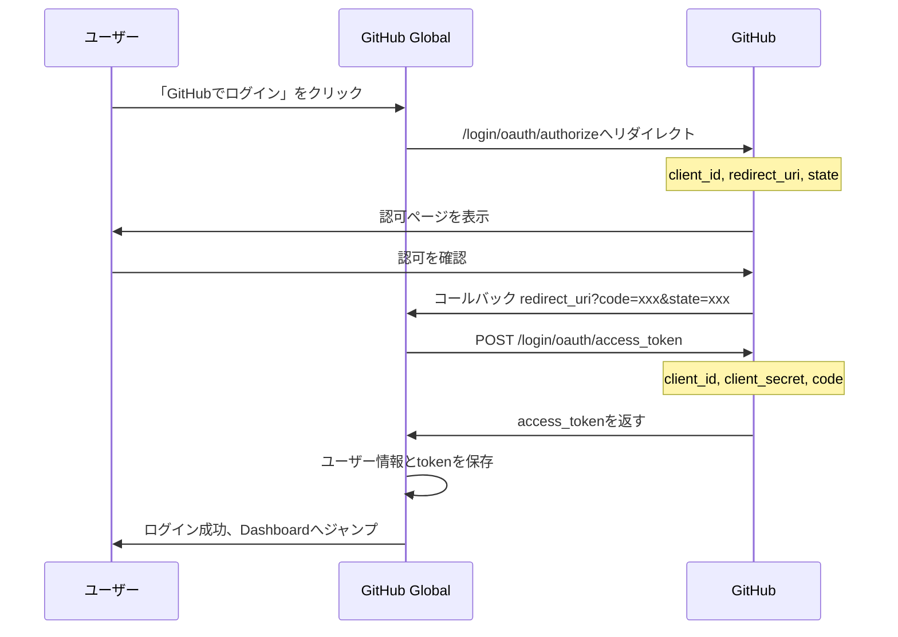

The user wants me to translate a Markdown document from zh-CN (Chinese Simplified) to ja (Japanese). I need to:

1. Preserve all Markdown formatting (headers, lists, code blocks, links, etc.)
2. NOT translate code snippets, variable names, function names, or technical identifiers
3. NOT translate URLs, file paths, or command-line examples
4. Preserve the original document structure exactly
5. Maintain a professional and accurate translation tone
6. Keep inline code (`code`) untranslated
7. Translate comments in code blocks if they are in the source language
8. Preserve all HTML tags and their attributes
9. Keep emojis and special characters as-is
10. Do NOT add any explanations or notes - output ONLY the translated content

Let me translate this document section by section, being careful to:
- Translate headings, body text, table content (except for technical terms)
- Keep code blocks as-is
- Keep URLs and file paths as-is
- Keep technical identifiers (like API names, function names) in English
- Translate comments in code blocks that are in Chinese

Let me start translating:
</think>

# GitHub Global - 技術実装方案ドキュメント

> バージョン：v1.0.0
> 日付：2026-01-21
> 作成者：テクニカルアーキテクト
> ステータス：レビュー待ち

---

## 1. ドキュメント概要

### 1.1 ドキュメントの目的

本文書は『要件仕様書 v1.0.0』にに基づき、GitHub Global プロジェクトの技術実装方案を詳細に記述するものである。技術アーキテクチャ、コアモジュール設計、APIインターフェース仕様、データベース設計、サードパーティサービス統合等内容を含む。

### 1.2 適用範囲

- MVP（Minimum Viable Product）フェーズの技術実装
- 開発チームの技術リファレンス

### 1.3 技術調査ソース

- GitHub REST API 公式ドキュメント（2025-2026）
- GitHub App 公式ドキュメント
- OpenRouter API 公式ドキュメント
- 業界ベストプラクティス

---

## 2. 技術スタック選定

### 2.1 技術スタック概要

| レイヤー | 技術選定 | バージョン要件 | 選定理由 |
|------|----------|----------|----------|
| **フロントエンドフレームワーク** | Next.js 15 (App Router) | ^15.0.0 | 2025-2026年主流フルスタックフレームワーク；SSR/SSGサポート；TypeScriptネイティブサポート；React 19サポート |
| **UIコンポーネントライブラリ** | shadcn/ui + Tailwind CSS | 最新版 | モダンな設計；高いカスタマイズ性；優れたパフォーマンス；ランタイム依存なし |
| **プログラミング言語** | TypeScript | ^5.0.0 | 型安全性；優れた開発体験；IDEサポート充実 |
| **データベース** | MySQL | ^8.0 | 成熟・安定；広く使用；運用容易 |
| **ORM** | Prisma | ^6.0.0 | 型安全性；マイグレーション管理；クエリビルダー |
| **バックグラウンドタスクキュー** | ローカルタスクキュー（BullMQ + Redisへ拡張可能） | - | MVPフェーズはローカルキュー、以降はRedisへ拡張 |
| **AI接入** | OpenRouter API | - | 複数モデルへの統一接入；fallbackサポート；コスト最適化 |
| **GitHub統合** | GitHub App + Octokit | - | 細やかな権限制御；Token自動失効；より安全 |
| **認証** | NextAuth.js v5 | ^5.0.0 | GitHub App OAuth統合；Session管理 |
| **デプロイ方式** | Dockerコンテナ化 | - | 移植性；環境一貫性；拡張容易 |

### 2.2 プロジェクト構造

```
github-global/
├── src/
│   ├── app/                      # Next.js App Router ページ
│   │   ├── (auth)/              # 認証関連ページ
│   │   │   ├── login/
│   │   │   └── callback/
│   │   ├── (dashboard)/         # ダッシュボードページ
│   │   │   ├── dashboard/
│   │   │   ├── repo/[id]/
│   │   │   ├── task/[id]/
│   │   │   └── settings/
│   │   ├── api/                 # APIルート
│   │   │   ├── auth/
│   │   │   ├── github/
│   │   │   ├── repos/
│   │   │   ├── translations/
│   │   │   └── webhooks/
│   │   ├── layout.tsx
│   │   └── page.tsx
│   ├── components/              # Reactコンポーネント
│   │   ├── ui/                  # shadcn/ui 基本コンポーネント
│   │   ├── layout/              # レイアウトコンポーネント
│   │   ├── repo/                # リポジトリ関連コンポーネント
│   │   ├── translation/         # 翻訳関連コンポーネント
│   │   └── common/              # 共通コンポーネント
│   ├── lib/                     # コアライブラリ
│   │   ├── github/              # GitHub APIラッパー
│   │   ├── openrouter/          # OpenRouter APIラッパー
│   │   ├── translation/         # 翻訳エンジン
│   │   ├── queue/               # タスクキュー
│   │   ├── db/                  # データベースユーティリティ
│   │   └── utils/               # ユーティリティ関数
│   ├── types/                   # TypeScript型定義
│   ├── hooks/                   # React Hooks
│   └── config/                  # 設定ファイル
├── prisma/
│   └── schema.prisma            # データベーススキーマ
├── public/                      # 静的アセット
├── docker/
│   ├── Dockerfile
│   └── docker-compose.yml
├── docs/                        # ドキュメント
├── tests/                       # テスト
├── .env.example                 # 環境変数サンプル
├── package.json
├── tsconfig.json
└── tailwind.config.ts
```

---

## 3. GitHub App 統合方案

### 3.1 なぜGitHub Appを選択するのか

GitHub公式ドキュメント（2025-2026）に 따르면、GitHub AppはOAuth Appと比較して以下の利点がある：

| 機能 | GitHub App | OAuth App |
|------|------------|-----------|
| 権限制御 | 細やかな権限（例：contents読み取り専用） | 粗いスコープ（repoは全権限を含む） |
| Token失効 | 1時間で自動失効 | 無期限（手動で取り消しが必要） |
| Rate Limit | 拡張可能（インストール数とユーザー数に基づく） | 固定5000/時間/ユーザー |
| 独立実行 | ユーザーなしで独立実行可能 | ユーザーにバインド必須 |
| Webhook | 内蔵集中管理 | 個別設定が必要 |

### 3.2 GitHub App 設定

#### 3.2.1 GitHub App の作成

GitHub Settings > Developer settings > GitHub Apps で新しいGitHub Appを作成：

**基本情報：**
- **App Name**: `GitHub Global`
- **Homepage URL**: `https://your-domain.com`
- **Callback URL**: `https://your-domain.com/api/auth/callback/github`
- **Setup URL**: `https://your-domain.com/dashboard`（インストール後ジャンプ）
- **Webhook URL**: `https://your-domain.com/api/webhooks/github`
- **Webhook Secret**: ランダムに生成されたシークレット

#### 3.2.2 権限設定

**Repository Permissions（リポジトリ権限）：**

| 権限 | レベル | 用途 |
|------|------|------|
| **Contents** | 読み取り＆書き込み | リポジトリファイルの読み取り、翻訳ファイルの作成、ブランチ作成 |
| **Metadata** | 読み取り | リポジトリ基本情報の読み取り |
| **Pull requests** | 読み取り＆書き込み | Pull Requestの作成と管理 |
| **Webhooks** | 読み取り＆書き込み | リポジトリイベント通知の受信（オプション、自動同期用） |

**Account Permissions（アカウント権限）：**

| 権限 | レベル | 用途 |
|------|------|------|
| **Email addresses** | 読み取り | commit送信用のユーザーメールアドレス取得 |

#### 3.2.3 Webhookイベント購読

| イベント | 用途 |
|------|------|
| `push` | コード変更を検出し、増分翻訳をトリガー（P2機能） |
| `installation` | Appインストール/アンインストールイベントを監視 |
| `installation_repositories` | リポジトリ追加/削除イベントを監視 |

### 3.3 認証フロー

#### 3.3.1 ユーザー認可フロー（User Access Token）



**認可URL構築：**

```typescript
const authUrl = new URL('https://github.com/login/oauth/authorize');
authUrl.searchParams.set('client_id', GITHUB_APP_CLIENT_ID);
authUrl.searchParams.set('redirect_uri', `${BASE_URL}/api/auth/callback/github`);
authUrl.searchParams.set('state', generateRandomState());
authUrl.searchParams.set('allow_signup', 'true');
```

#### 3.3.2 Installation Access Token取得

Appとしてリポジトリを操作する必要がある場合、Installation Access Tokenを取得する：

```typescript
import { App } from 'octokit';

// GitHub App初期化
const app = new App({
  appId: GITHUB_APP_ID,
  privateKey: GITHUB_APP_PRIVATE_KEY,
});

// Installation Access Token取得
async function getInstallationToken(installationId: number) {
  const octokit = await app.getInstallationOctokit(installationId);
  return octokit;
}
```

**Tokenキャッシュ戦略：**
- Installation Access Token有効期間は1時間
- 失効5分前に更新するTokenキャッシュ機構を実装
- キャッシュキー: `github:installation:${installationId}:token`

### 3.4 重要なAPI呼び出し

#### 3.4.1 リポジトリコンテンツ取得

```typescript
// GET /repos/{owner}/{repo}/contents/{path}
async function getRepoContents(
  octokit: Octokit,
  owner: string,
  repo: string,
  path: string = ''
) {
  const { data } = await octokit.rest.repos.getContent({
    owner,
    repo,
    path,
  });
  return data;
}
```

#### 3.4.2 ブランチ作成

```typescript
// POST /repos/{owner}/{repo}/git/refs
async function createBranch(
  octokit: Octokit,
  owner: string,
  repo: string,
  branchName: string,
  baseSha: string
) {
  const { data } = await octokit.rest.git.createRef({
    owner,
    repo,
    ref: `refs/heads/${branchName}`,
    sha: baseSha,
  });
  return data;
}
```

#### 3.4.3 ファイル作成/更新

```typescript
// PUT /repos/{owner}/{repo}/contents/{path}
async function createOrUpdateFile(
  octokit: Octokit,
  owner: string,
  repo: string,
  path: string,
  content: string,
  message: string,
  branch: string,
  sha?: string  // 更新時に必要
) {
  const { data } = await octokit.rest.repos.createOrUpdateFileContents({
    owner,
    repo,
    path,
    message,
    content: Buffer.from(content).toString('base64'),
    branch,
    sha,
  });
  return data;
}
```

#### 3.4.4 Pull Request作成

```typescript
// POST /repos/{owner}/{repo}/pulls
async function createPullRequest(
  octokit: Octokit,
  owner: string,
  repo: string,
  title: string,
  body: string,
  head: string,  // ソースブランチ
  base: string   // ターゲットブランチ
) {
  const { data } = await octokit.rest.pulls.create({
    owner,
    repo,
    title,
    body,
    head,
    base,
  });
  return data;
}
```

#### 3.4.5 Commits比較（変更検出）

```typescript
// GET /repos/{owner}/{repo}/compare/{basehead}
async function compareCommits(
  octokit: Octokit,
  owner: string,
  repo: string,
  base: string,
  head: string
) {
  const { data } = await octokit.rest.repos.compareCommits({
    owner,
    repo,
    basehead: `${base}...${head}`,
  });
  return data;
}
```

### 3.5 Rate Limit対応

GitHub API Rate Limit：
- **認証リクエスト**: 5,000 requests/hour/user
- **GitHub App**: より高く拡張可能

**対応戦略：**

```typescript
import { Octokit } from 'octokit';

const octokit = new Octokit({
  auth: token,
  throttle: {
    onRateLimit: (retryAfter, options) => {
      console.warn(`Rate limit hit, retrying after ${retryAfter}s`);
      if (options.request.retryCount <= 2) {
        return true; // 再試行
      }
      return false;
    },
    onSecondaryRateLimit: (retryAfter, options) => {
      console.warn(`Secondary rate limit hit`);
      return false;
    },
  },
});
```

---

## 4. OpenRouter API 統合方案

### 4.1 OpenRouter概要

OpenRouterは多種多様なAIモデルへの統一API接入を提供：
- OpenAI GPTシリーズ
- Anthropic Claudeシリーズ
- Google Geminiシリーズ
- その他のオープンソースモデル

### 4.2 API設定

**基本設定：**

```typescript
// config/openrouter.ts
export const OPENROUTER_CONFIG = {
  baseUrl: 'https://openrouter.ai/api/v1',
  defaultModel: 'anthropic/claude-3.5-sonnet',
  fallbackModels: [
    'openai/gpt-4o',
    'google/gemini-pro-1.5',
  ],
  maxTokens: 4096,
  temperature: 0.3,  // 翻訳タスクは低温度を使用
};
```

### 4.3 Chat Completion API

**リクエスト形式：**

```typescript
// lib/openrouter/client.ts
interface ChatCompletionRequest {
  model: string;
  messages: Array<{
    role: 'system' | 'user' | 'assistant';
    content: string;
  }>;
  max_tokens?: number;
  temperature?: number;
  stream?: boolean;
}

async function createChatCompletion(
  request: ChatCompletionRequest,
  apiKey: string
): Promise<ChatCompletionResponse> {
  const response = await fetch('https://openrouter.ai/api/v1/chat/completions', {
    method: 'POST',
    headers: {
      'Authorization': `Bearer ${apiKey}`,
      'Content-Type': 'application/json',
      'HTTP-Referer': 'https://github-global.com',
      'X-Title': 'GitHub Global',
    },
    body: JSON.stringify({
      model: request.model,
      messages: request.messages,
      max_tokens: request.max_tokens || 4096,
      temperature: request.temperature || 0.3,
      stream: request.stream || false,
    }),
  });

  if (!response.ok) {
    const error = await response.json();
    throw new OpenRouterError(error.error.message, response.status);
  }

  return response.json();
}
```

### 4.4 翻訳Prompt設計

```typescript
// lib/translation/prompts.ts
export function buildTranslationPrompt(
  content: string,
  sourceLanguage: string,
  targetLanguage: string
): ChatCompletionRequest {
  return {
    model: 'anthropic/claude-3.5-sonnet',
    messages: [
      {
        role: 'system',
        content: `You are a professional technical documentation translator. Your task is to translate Markdown documents from ${sourceLanguage} to ${targetLanguage}.

Rules:
1. Preserve all Markdown formatting (headers, lists, code blocks, links, etc.)
2. Do NOT translate code snippets, variable names, function names
3. Do NOT translate URLs, file paths, or technical identifiers
4. Preserve the original document structure
5. Maintain a professional and accurate translation tone
6. Keep inline code (\`code\`) untranslated
7. Translate comments in code blocks if they are in the source language
8. Preserve all HTML tags and their attributes

Output only the translated content, no explanations.`,
      },
      {
        role: 'user',
        content: `Translate the following Markdown content:\n\n${content}`,
      },
    ],
    temperature: 0.3,
  };
}
```

### 4.5 Streaming応答処理

```typescript
// lib/openrouter/streaming.ts
async function* streamChatCompletion(
  request: ChatCompletionRequest,
  apiKey: string
): AsyncGenerator<string> {
  const response = await fetch('https://openrouter.ai/api/v1/chat/completions', {
    method: 'POST',
    headers: {
      'Authorization': `Bearer ${apiKey}`,
      'Content-Type': 'application/json',
    },
    body: JSON.stringify({
      ...request,
      stream: true,
    }),
  });

  const reader = response.body?.getReader();
  const decoder = new TextDecoder();

  while (true) {
    const { done, value } = await reader!.read();
    if (done) break;

    const chunk = decoder.decode(value);
    const lines = chunk.split('\n').filter(line => line.startsWith('data: '));

    for (const line of lines) {
      const data = line.slice(6);
      if (data === '[DONE]') return;

      try {
        const parsed = JSON.parse(data);
        const content = parsed.choices[0]?.delta?.content;
        if (content) yield content;
      } catch {
        // パースエラーを無視
      }
    }
  }
}
```

### 4.6 エラー処理と再試行

```typescript
// lib/openrouter/retry.ts
interface RetryConfig {
